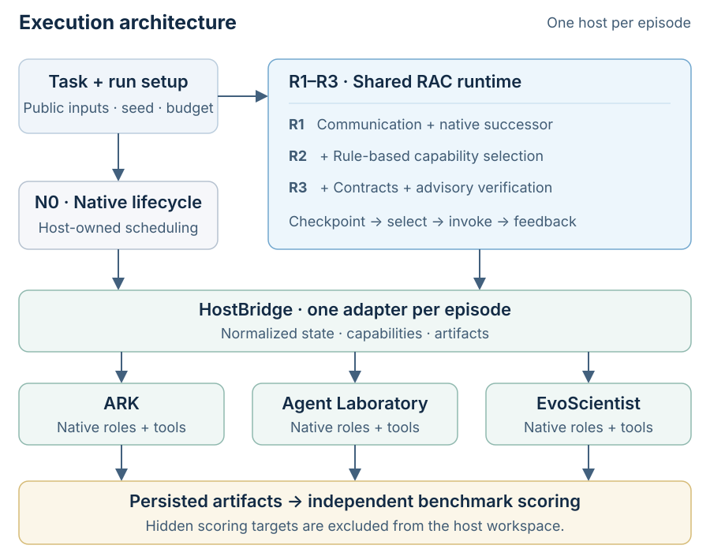

# Runtime AI Scientist — Interactive Architecture

An English, source-backed architecture visualization of [Runtime AI Scientist](https://github.com/systemind-team/Runtime-AI-Scientist), maintained as a personal visualization by JY0xLU.

**[Open interactive architecture ↗](https://jy0xlu.github.io/runtime-ai-scientist-architecture/)** · [Download HTML](https://github.com/JY0xLU/runtime-ai-scientist-architecture/raw/refs/heads/main/index.html) · [SVG overview](architecture.svg)

The interactive map supports zoom, node focus, source references, light/dark themes and export. Source references are pinned to upstream revision `bf11766341e2fbf60612bf486f577d6db33ea259`.

This repository contains visualization assets only. Research implementation and experiment data are not included. For the original project and paper, see the [official repository](https://github.com/systemind-team/Runtime-AI-Scientist) and [arXiv paper](https://arxiv.org/abs/2610.00980).

Generated with [Archify](https://github.com/tt-a1i/archify). See [Archify's MIT license](ARCHIFY-LICENSE.txt) and the [embedded font license](FONT-LICENSE.txt).
